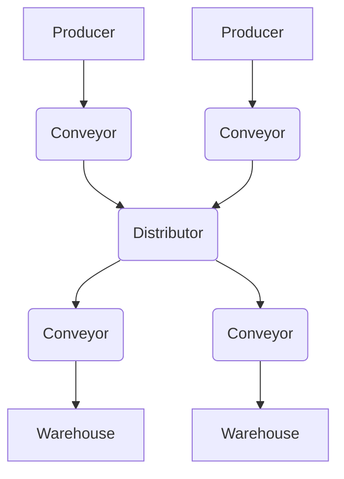
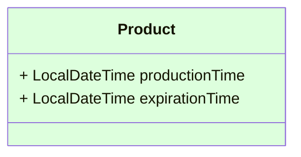
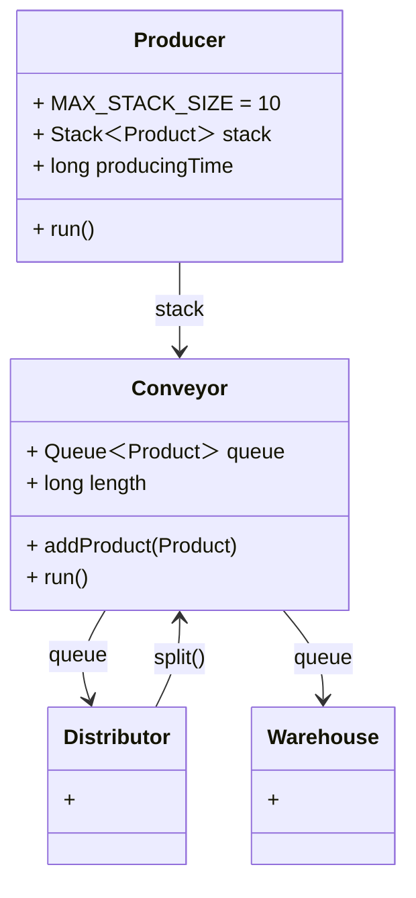
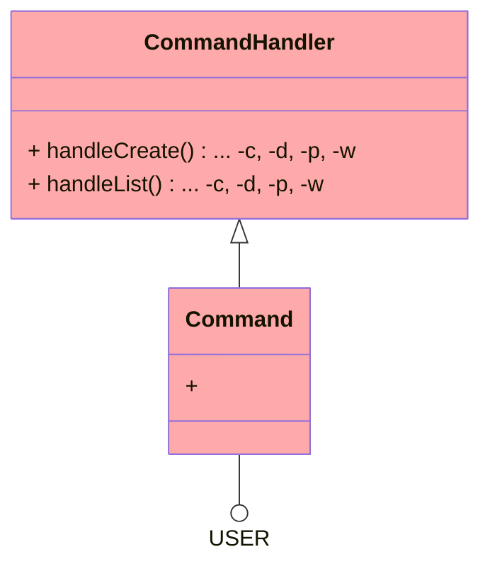

### JAVA Factory

Make factory with **multithreading**. Also learn about **Producer-Consumer Pattern** and Java's **Data Structures**.
 
 

> Simple Flow Chart!

```mermaid
flowchart TD
    A[Producer] -->B(Conveyor)
	I[Producer] -->J(Conveyor)
    B --> C(Distributor)
	J --> C
    C --> D(Conveyor)
	C --> E(Conveyor)
    D -->G[Warehouse]
    E -->H[Warehouse]
```

 
 

> Simple Class Info!

```mermaid
classDiagram
    class Product:::green{
		+ LocalDateTime productionTime
		+ LocalDateTime expirationTime
}

classDef green fill:#dfd
```

```mermaid
classDiagram
	class Producer{
		+ MAX_STACK_SIZE = 10
		+ Stack＜Product＞ stack
		+ long producingTime
		+ run()
}
	class Conveyor{
		+ Queue＜Product＞ queue
		+ long length
		+ addProduct(Product)
		+ run()
}
Producer --> Conveyor : stack
	class Distributor{
		+
}

Conveyor --> Distributor : queue
Distributor --> Conveyor : split()

	class Warehouse{
		+
}

Conveyor --> Warehouse : queue
```

```mermaid
classDiagram
    class CommandHandler:::red{
        + handleCreate()... -c, -d, -p, -w
        + handleList()... -c, -d, -p, -w
}
    class Command:::red{
        +
}
CommandHandler <|-- Command
Command --() USER
classDef red fill:#faa
```