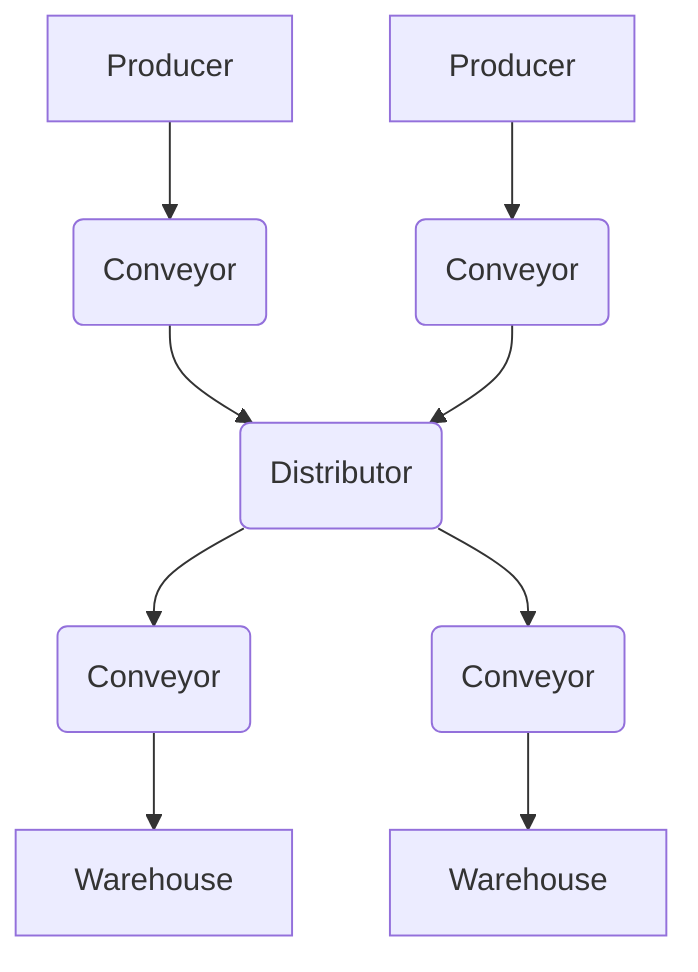
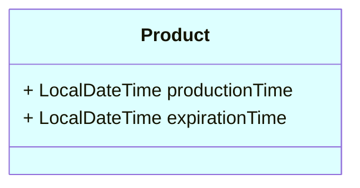
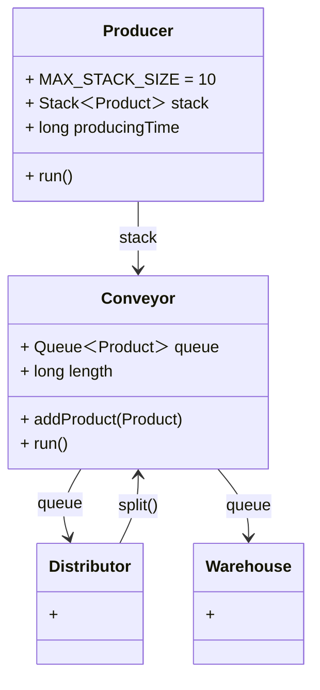

### JAVA Factory

Make factory with **multithreading**. Also learn about **Producer-Consumer Pattern** and Java's **Data Structures**.
<br>
<br>

> Simple Flow Chart!



<br>
<br>

> Simple Class Info!





```mermaid
classDiagram
    class Command:::creen{
        interface*
        + execute()
}
    class CommandContext{
        + Map＜string,$var＞ $varMap
        + Map＜string,$var＞ $varMap
        + ...
        + show$Var()
}
    class Create`{$var}`:::green{
        + execute()
        + ...
}
    class List`{$var}`:::green{
        + execute()
        + ...
}

    class `{...}`:::green{
        + execute()
        + ...
}

    class CommandRegistry:::green{
        + Map＜String, Command＞ commandMap
        + CommandContext context
        + getCommand(command)
}
    class CommandHandler:::green{
        + CommandRegistry registry
        + handle(command)
}

Command --|> Create`{$var}` 
Command --|> List`{$var}`
Command --|> `{...}`
CommandContext --> Create`{$var}` 
CommandContext --> List`{$var}`
CommandContext --> `{...}`
Create`{$var}` --> CommandRegistry
List`{$var}` --> CommandRegistry
`{...}` --> CommandRegistry
CommandRegistry --> CommandHandler
CommandRegistry --> Main
CommandHandler --> Main
classDef creen fill:#efe
classDef green fill:#cfc
```